# 25 Best Online Language Learning Platforms in 2025

Ever started learning a language through an app only to realize three months later you still can't hold a basic conversation because nobody's actually correcting your pronunciation? Or maybe you've bounced between ten different free apps without making real progress because they're all teaching you to say "the cat is on the table" instead of phrases you'd actually use? Online language learning platforms solve this by connecting you with real tutors or structured lessons that adapt to your goals—whether you're preparing for business meetings, planning travel, or just want to finally understand your favorite foreign films without subtitles.

## [Preply](https://preply.com)

A global tutoring marketplace connecting learners with over 32,000 verified tutors across 50+ languages, offering flexible one-on-one lessons tailored to individual goals and learning styles.

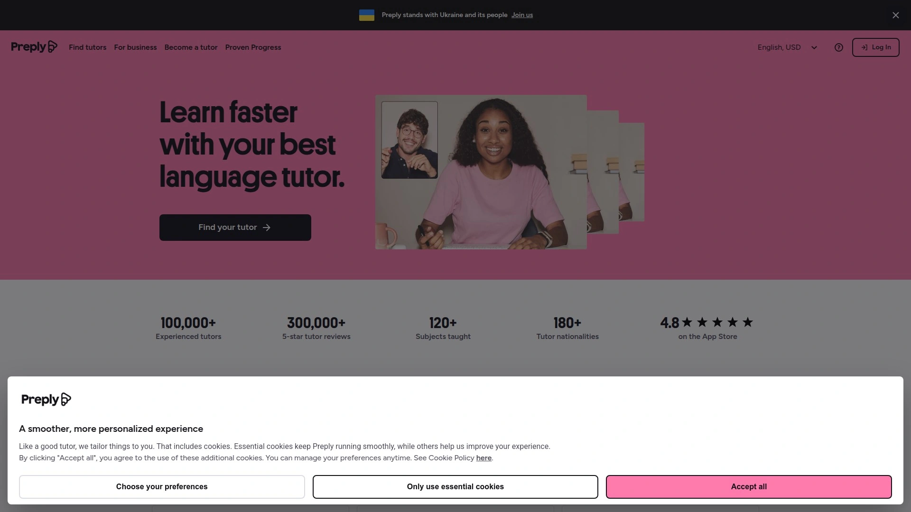

Preply stands out through its massive tutor selection letting you filter by availability, price, country of origin, and teaching specialization. Unlike rigid course structures, you directly message potential tutors before booking, discussing your specific goals—whether that's business Spanish, conversational French, or IELTS prep. This flexibility means finding someone whose teaching style matches your learning personality.

**Lesson customization** happens organically as tutors adapt to your pace and interests. Want to focus only on pronunciation? Your tutor adjusts. Need vocabulary for your upcoming trip? They build lessons around that. This personalization beats generic app lessons designed for millions.

Pricing varies dramatically based on tutor experience and location—expect $10-50+ per hour. Filipino and South African tutors typically charge $10-22 while American and British tutors run $15-30. This range accommodates different budgets while maintaining quality since all tutors submit verification materials.

**Trial lessons** let you test compatibility before committing. If unsatisfied, Preply offers full refunds on first lessons. Subscription packages work in 28-day cycles where you pre-select lesson quantities. More lessons purchased upfront reduces per-lesson cost.

Video platform built into Preply eliminates needing Skype or Zoom. Integrated materials, homework assignments, and progress tracking keep everything centralized. Mobile app enables learning anywhere.

Reviews and ratings provide transparency—see exactly how many lessons each tutor completed and read detailed student feedback. This vetting helps avoid mismatches. Best for learners wanting human interaction and personalized curriculum over app-based self-study.

## [italki](https://www.italki.com)

A pioneering language exchange and tutoring platform offering the largest tutor selection globally, plus free community features for practice and corrections.

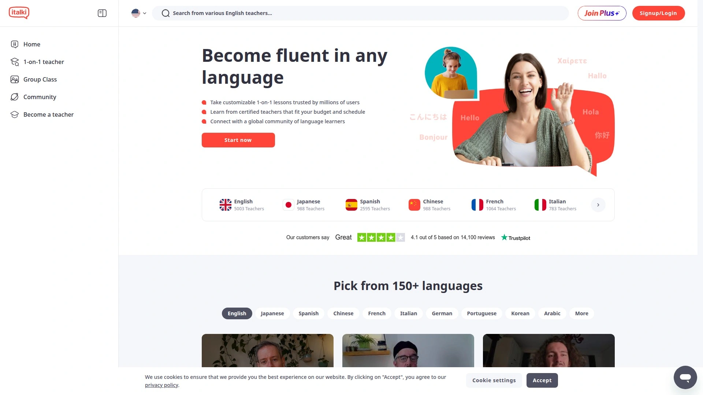

italki invented the online language tutoring marketplace model, building the most extensive tutor network across virtually every language including rare ones competitors don't offer. Over 10,000 teachers provide either professional lessons or informal conversation practice at different price points. This distinction lets budget-conscious learners book cheaper community tutors for speaking practice while reserving certified teachers for structured grammar lessons.

Free community tools complement paid lessons. Writing correction feature lets native speakers edit your essays at no cost. Discussion forums connect learners globally. Language exchange matching pairs you with someone learning your native language. These extras provide practice between formal lessons without additional spending.

Search filters show tutor qualifications, completed lesson counts, ratings, and pricing transparently. Video introductions from each tutor reveal teaching style before booking. Detailed profiles list specializations like business vocabulary or test prep.

Flexible pay-per-lesson model means no subscription commitments. Purchase individual lessons or small packages. Credits system lets you book with different tutors without separate transactions.

Platform interface feels slightly dated compared to newer competitors but functionality remains solid. Mobile app works adequately though desktop experience superior. Best for learners prioritizing maximum tutor choice and community features over polished interface.

## [Cambly](https://www.cambly.com)

An instant-access English tutoring service connecting learners with native speakers on-demand through quick 15-30 minute sessions, perfect for spontaneous practice.

Cambly removes scheduling friction by letting you instantly connect with available tutors. Open the app, hit a button, and start speaking English with a native speaker within seconds. This spontaneity suits busy schedules where planning lessons days ahead feels impractical.

Session flexibility offers 15, 30, or 60 minute reservations plus unlimited on-demand access depending on subscription level. Quick 15-minute sessions fit lunch breaks or commutes. No teaching certificates required for tutors—just native English speaking. This creates more casual, conversational atmosphere versus formal instruction.

**Cambly Kids** separates children's learning with tutors trained specifically for young learners. Different pricing and specialized content make it age-appropriate.

Recording feature automatically saves lesson videos for review. Playback helps identify pronunciation errors and track progress. Chat translation tool assists during lessons when stuck on vocabulary.

Focus exclusively on English limits usefulness for multilingual learners. Those studying Spanish, French, or other languages need different platforms. Pricing runs higher than some competitors given the on-demand convenience.

Best for English learners wanting spontaneous conversation practice without scheduling hassles. Less suitable for structured curriculum or non-English languages.

## [Verbling](https://www.verbling.com)

A professional tutoring platform emphasizing qualified teachers, reliable technology, and pay-per-lesson flexibility across 70+ languages.

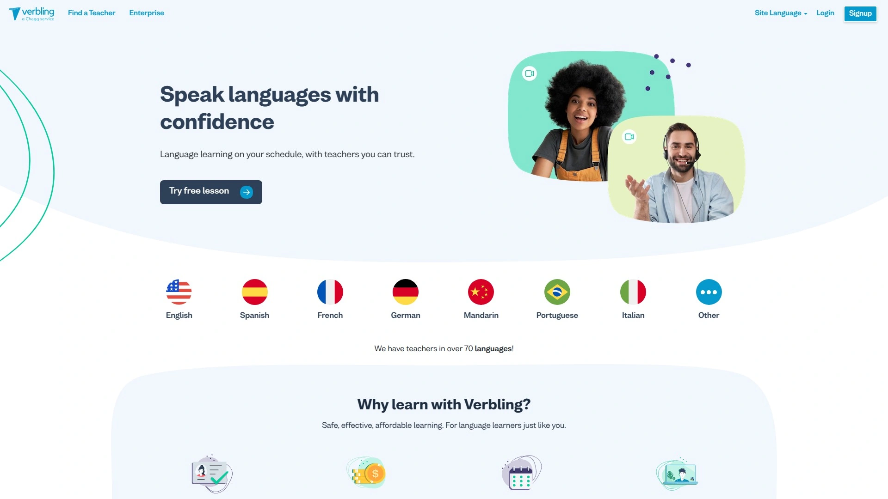

Verbling requires tutors demonstrate fast, stable internet connections before approval, eliminating the frustrating connection drops plaguing other platforms. This quality control extends to teacher qualifications and demo video requirements. The result: consistently professional lessons without technical interruptions.

Pay-per-lesson model removes subscription pressure. Book individual lessons using any payment method without buying credit packages upfront. This flexibility helps learners testing multiple tutors or studying sporadically.

**Free 30-minute trial lessons** let you evaluate teacher compatibility before financial commitment. Unlimited trials with different tutors until finding the right match. This generosity reduces risk compared to paid trial models.

Video platform built specifically for language lessons includes screenshare, digital whiteboard, and integrated materials. Purpose-built tools beat generic video chat apps. Automatic lesson recording available for review.

Over 10,000 teachers across 70+ languages provide broad selection. Search filters by availability, price, specialty, and teaching style. Detailed profiles show experience and student ratings.

Interface feels modern and professional. Mobile apps function smoothly. Best for learners wanting quality assurance and flexible payment over maximum tutor quantity.

## [Duolingo](https://www.duolingo.com)

The world's most popular language app offering completely free gamified lessons across 40+ languages with optional premium features.

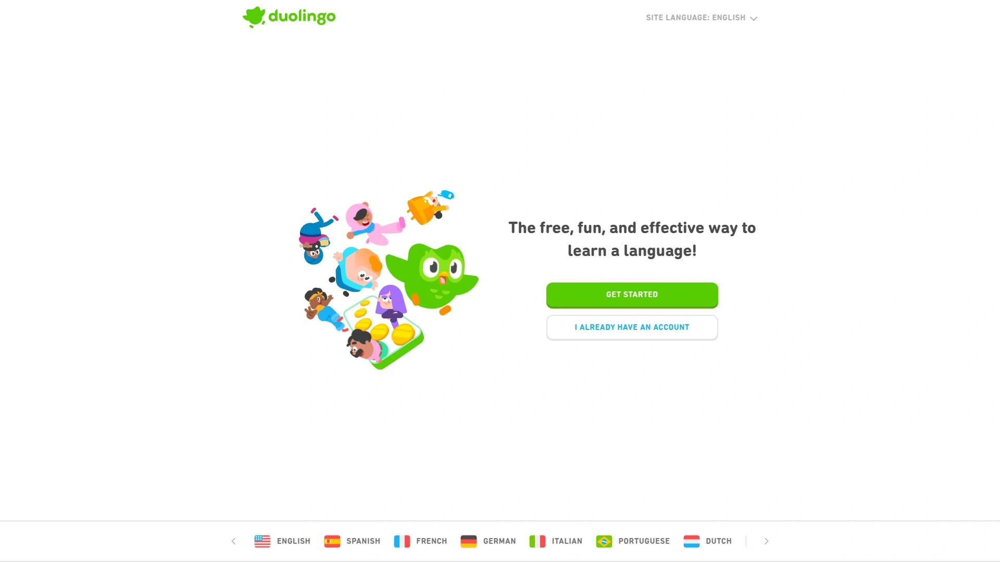

Duolingo built its reputation on genuinely free, high-quality content accessible to everyone. No credit card required, no time limits, no feature restrictions on core lessons. This accessibility democratizes language learning globally.

**Gamification** makes daily practice addictive through streak counters, experience points, and league competitions. Five-minute lessons fit any schedule. Bite-sized format reduces overwhelm for beginners.

Lesson progression moves from basic vocabulary through grammar structures systematically. Repetition reinforces learning through multiple exercise types. Speaking and listening practice included though pronunciation feedback limited on free tier.

Stories feature provides longer-form content for intermediate learners in select languages. Podcasts add authentic listening practice. These extras supplement core lessons without additional cost.

Super subscription removes ads, enables offline access, and unlocks unlimited hearts. Monthly cost around $13. However, free version remains fully functional for dedicated learners.

Limited for advanced learners or those needing conversation practice. Vocabulary selection sometimes impractical. Best for beginners wanting structured introduction at zero cost.

## [Babbel](https://www.babbel.com)

A subscription-based app offering structured, practical lessons focused on conversational skills across 14 languages with professional course design.

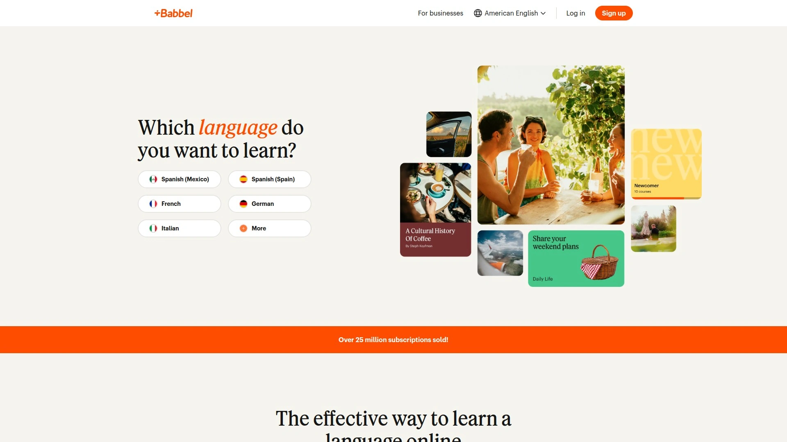

Babbel emphasizes real-world conversation from lesson one. Dialogues feature practical situations like ordering food, asking directions, or making small talk. Grammar explanations clarify rules clearly in your native language. This explicit teaching aids adult learners who benefit from understanding why.

Speech recognition provides pronunciation feedback. Record phrases, receive correction, practice until accurate. This beats apps without speaking components.

**Lessons designed by language experts** follow logical progression. Each 10-15 minute session builds on previous knowledge systematically. Review manager schedules vocabulary practice using spaced repetition. This scientifically-backed approach improves retention.

Courses tailored for English speakers learning specific languages. Cultural notes explain local customs and context. Business-focused lessons available for professional vocabulary.

Subscription required for full access—no meaningful free tier. Monthly cost around $14, annual subscriptions reduce per-month expense. Lifetime deals sometimes available.

Fourteen languages limit options compared to Duolingo's 40+. Content depth excels within covered languages. Best for beginners through intermediate learners wanting structured, practical curriculum.

## [Rosetta Stone](https://www.rosettastone.com)

A veteran language program using immersive teaching methodology without translations, emphasizing visual associations and natural language acquisition.

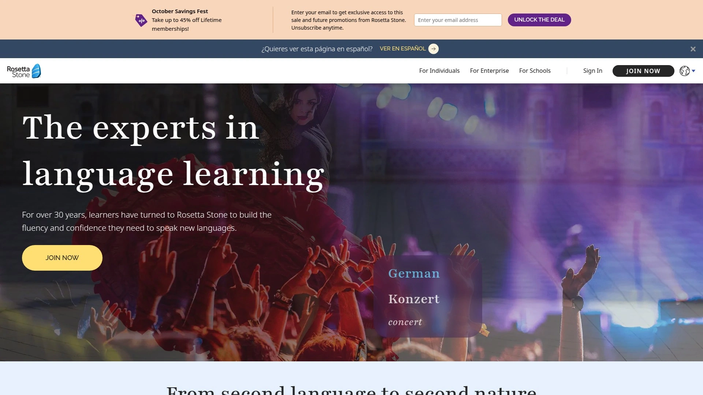

Rosetta Stone pioneered immersion-based learning where all instruction happens in target language from day one. Images paired with words teach meaning through context rather than translation. This mirrors how children acquire first languages.

**TruAccent speech recognition** provides detailed pronunciation feedback. Record speech, compare to native speakers, adjust until accurate. More sophisticated than competitors' basic voice recognition.

Varied exercise types maintain engagement—matching images to words, arranging sentence structures, listening comprehension, speaking practice. Lessons range 30-60 minutes. Longer sessions suit learners dedicating focused study time.

Twenty-five languages covered including less common options. Content volume within each language substantial. Structured progression from complete beginner through intermediate levels.

No free trial requires upfront payment. Subscription cost higher than most competitors. Single-language access typical unless purchasing expensive lifetime unlimited plan.

Lack of grammar explanations frustrates some learners. Immersion works brilliantly for some, confuses others. Requires significant time investment—brief daily practice insufficient for meaningful progress. Best for dedicated learners with time for deep immersion.

## [Busuu](https://www.busuu.com)

A social learning platform combining structured CEFR-aligned courses with community corrections from native speakers across 14 languages.

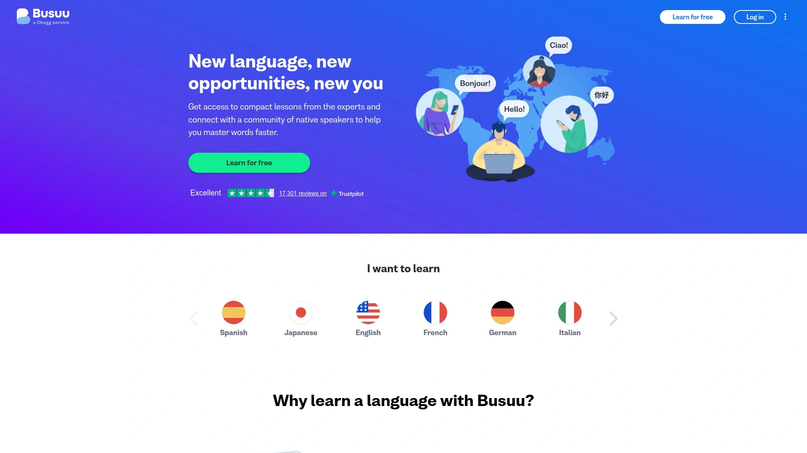

Busuu structures courses around Common European Framework of Reference levels A1 through C1. This standardization helps learners understand proficiency progression and set clear goals. Completion certificates verify achievement.

**Community feature** connects learners with native speakers who correct written exercises and provide feedback. Submit essay, receive corrections from multiple natives explaining errors. This human element adds value beyond algorithm-based apps.

Lessons combine vocabulary, grammar, reading, writing, listening, and speaking practice. Speech recognition evaluates pronunciation. Dialogue practice simulates conversations.

Study plan generates personalized learning schedules based on available time and target completion date. AI adapts difficulty to performance. Review manager schedules vocabulary practice optimally.

Offline mode downloads lessons for internet-free learning. Mobile and desktop apps sync progress.

Free version offers limited lessons. Premium subscription around $14 monthly unlocks full course access, grammar lessons, and community corrections. Premium Plus adds McGraw-Hill language certificate.

Best for learners wanting structured progression plus community interaction.

## [Memrise](https://www.memrise.com)

A vocabulary-focused platform using spaced repetition, native speaker videos, and memory techniques to build practical language skills.

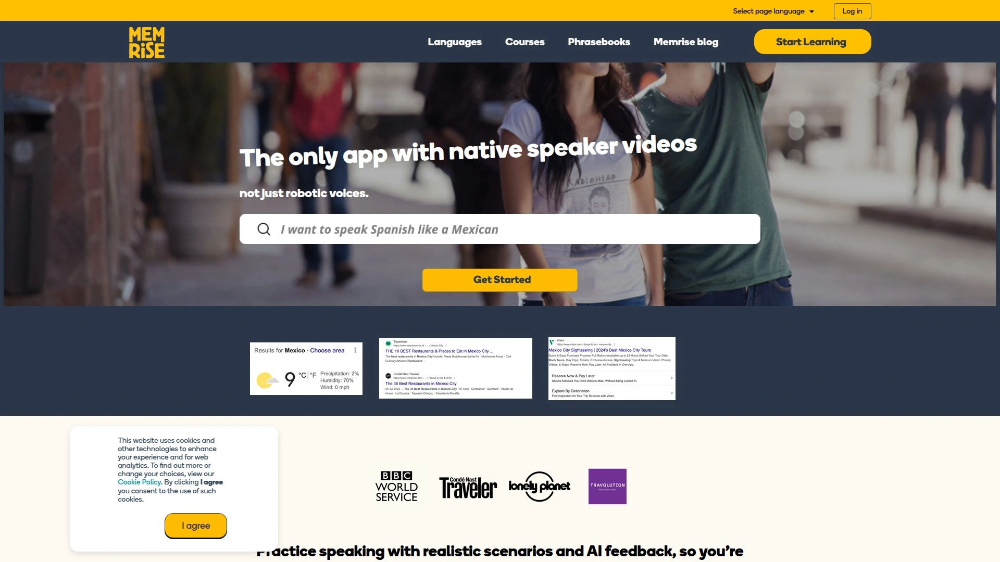

Memrise excels at vocabulary acquisition through scientifically-backed spaced repetition algorithms. Words introduced, practiced, then reviewed at optimal intervals for long-term retention. This method proven more effective than cramming.

**Native speaker videos** show real people using words in context. Hear authentic pronunciation from various accents. Immerse feature extracts learning from YouTube videos based on your interests. This connects memorization to real-world usage.

MemBot AI simulates conversations providing instant feedback. Practice speaking without human partner availability. Scenarios cover practical situations.

Over 30 languages plus both official and community-created courses. Community courses offer specialized vocabulary like medical terms or slang. Quality varies in user-generated content.

Gamification elements keep motivation high through points and leaderboards. Daily goals encourage consistent practice.

Free tier provides limited access. Pro subscription $15-28 monthly depending on plan length. Lifetime option occasionally discounted to $99.

Limited grammar instruction and structured speaking practice. Best for vocabulary building and listening comprehension.

## [Lingoda](https://www.lingoda.com)

A structured online language school offering live group and private Zoom classes with certified teachers following CEFR curriculum.

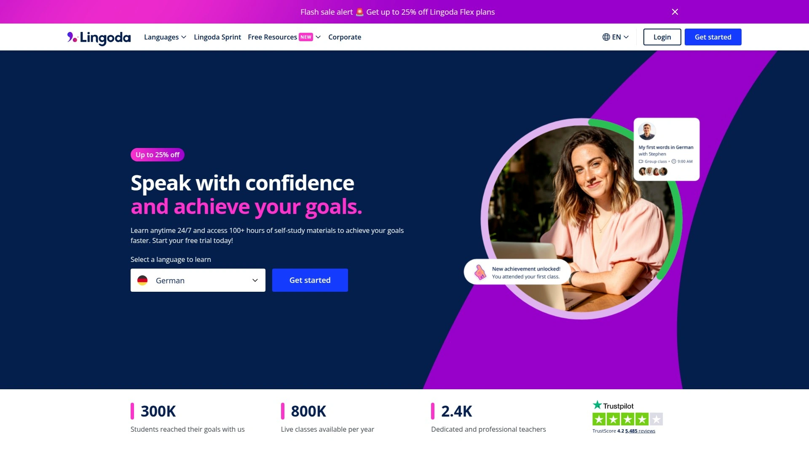

Lingoda provides traditional school-like structure through scheduled live classes. Teachers hold recognized teaching certifications. Curriculum follows CEFR framework with clear level progression.

**Class materials** downloaded before sessions show exactly what will be covered. Teachers work systematically through PDFs during lessons. This predictability helps anxious learners know what to expect.

Small group classes typically 3-5 students create manageable interaction. Private lessons available for personalized attention. Both options taught via Zoom.

Classes available 24/7 across multiple time zones. Book sessions matching your schedule. Attendance flexibility suits busy lifestyles.

Suitable for beginners through advanced learners including maintenance classes for fluent speakers. Long-term students work through comprehensive curriculum.

Requires pairing with self-study for beginners. Classes alone insufficient for complete language acquisition. Monthly subscriptions start around $80 for group classes.

Best for learners wanting live instruction structure similar to traditional school.

## [HelloTalk](https://www.hellotalk.com)

A language exchange social network connecting millions of users worldwide for free text, voice, and video practice with built-in translation and correction tools.

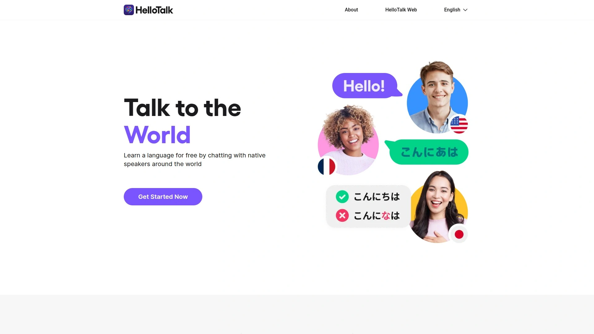

HelloTalk transforms language learning into social networking. Ten million+ users provide endless potential conversation partners. Find native speakers of your target language learning your native language. This mutual benefit motivates sustained engagement.

**Built-in correction tools** let partners fix each other's mistakes directly in chat. Click any message to see translation, transliteration, or hear text-to-speech. These features facilitate communication despite language barriers.

Moments feature functions like Instagram where users post photos and updates. Voice recording tools enable pronunciation practice. This social component builds community beyond one-on-one messaging.

Emoji-heavy, cartoony interface appeals to some, overwhelms others. Design feels more playful than professional.

Audio lessons available in 10 languages require subscription. Free version includes ads and limited features. Pro subscription removes ads and unlocks advanced tools.

Success depends heavily on finding compatible, reliable partners. Some users ghost conversations. Requires self-direction since no structured curriculum exists.

Best for outgoing learners wanting free conversation practice.

## [Tandem](https://www.tandem.net)

A sleek language exchange app emphasizing serious learners through matching algorithms, professional tutoring options, and focused conversation features.

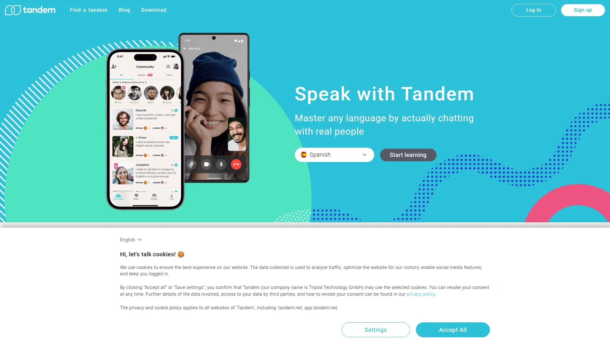

Tandem emphasizes quality interactions over quantity through refined matching algorithms. Detailed profiles help find compatible partners sharing interests. This curation leads to more sustained partnerships.

**Clean, modern interface** prioritizes messaging over social features. Less cluttered than HelloTalk. Design appeals to users wanting straightforward language exchange.

Text, voice, and video calling built-in. Correction tools work similarly to HelloTalk. Translation available but encourages using target language.

Separate tutoring service connects users with professional teachers for paid lessons. This hybrid model serves both free exchange seekers and those wanting structured instruction.

Community topics prompt conversations around specific subjects. Certificate verification confirms serious learners. These features reduce time-wasters.

Free version functional with ads. Pro subscription adds unlimited translations and other perks.

Success still depends on partner reliability. Some prefer HelloTalk's more social approach. Best for focused learners wanting polished exchange experience.

## [AmazingTalker](https://en.amazingtalker.com)

A tutoring marketplace requiring university degrees or native speaker status from teachers, offering customizable lessons across 60+ languages.

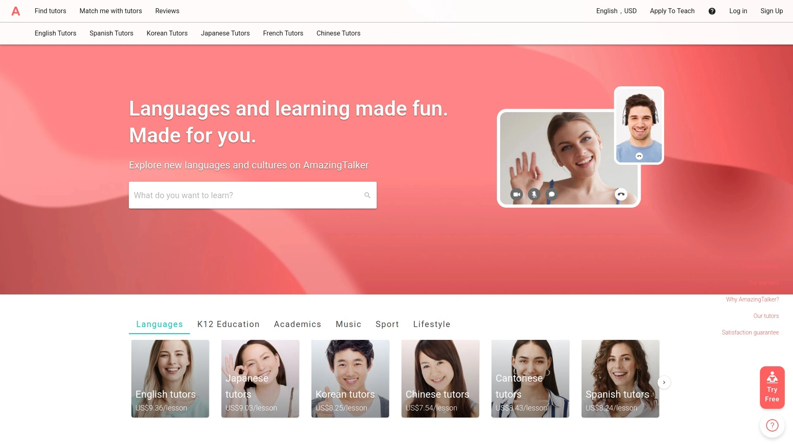

AmazingTalker positions between casual tutoring sites and professional schools through stricter teacher requirements. Tutors must hold university degrees or native speaker credentials plus demonstrate teaching experience. This vetting ensures minimum quality standards.

Lesson customization allows negotiating curriculum directly with tutors. Discuss goals, preferred materials, and learning style before starting. Flexibility suits specific needs like business vocabulary or exam prep.

**Trial lessons** typically 25 minutes let you test teachers before committing to regular packages. Standard lessons run 50 minutes. This structure balances thorough instruction with manageable scheduling.

Pricing varies by teacher experience and native speaker status. Comparison tools show rates across nationalities. Platform provides transparent pricing guides.

Mobile app enables booking and lessons on smartphones. Desktop platform offers full features. Cross-device syncing maintains consistency.

Over 60 languages including less common options. Best for learners wanting quality-vetted tutors with customization flexibility.

## [Pimsleur](https://www.pimsleur.com)

An audio-based program emphasizing listening and speaking through scientifically designed 30-minute daily lessons across 50+ languages.

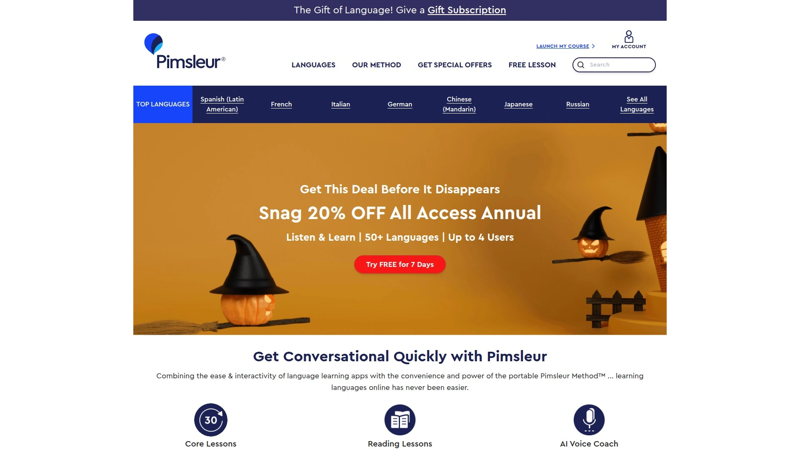

Pimsleur focuses exclusively on audio learning, requiring no reading or visual components. Thirty-minute lessons use graduated interval recall—information presented, then tested at increasing intervals. This methodology proven to enhance long-term retention.

**Hands-free learning** enables practicing while driving, exercising, or doing chores. Driving mode in mobile app optimizes for car use. This flexibility maximizes otherwise wasted time.

Voice recognition requires speaking aloud throughout lessons. Pronunciation emphasized from day one. Listening comprehension develops through native speaker audio.

Fifty-plus languages available including rare options. One subscription unlocks all languages for just $1 more than single-language access. This multi-language value appeals to polyglots and families.

Limited visual learning disappoints learners needing to see written words. No grammar explanations provided. Vocabulary building slower than text-based apps.

Premium subscription around $20 monthly. All-Access includes every language. Best for auditory learners and those wanting speaking fluency over reading skills.

## [Mango Languages](https://mangolanguages.com)

A comprehensive platform offering 70+ languages with cultural notes, grammar explanations, and conversation-focused lessons.

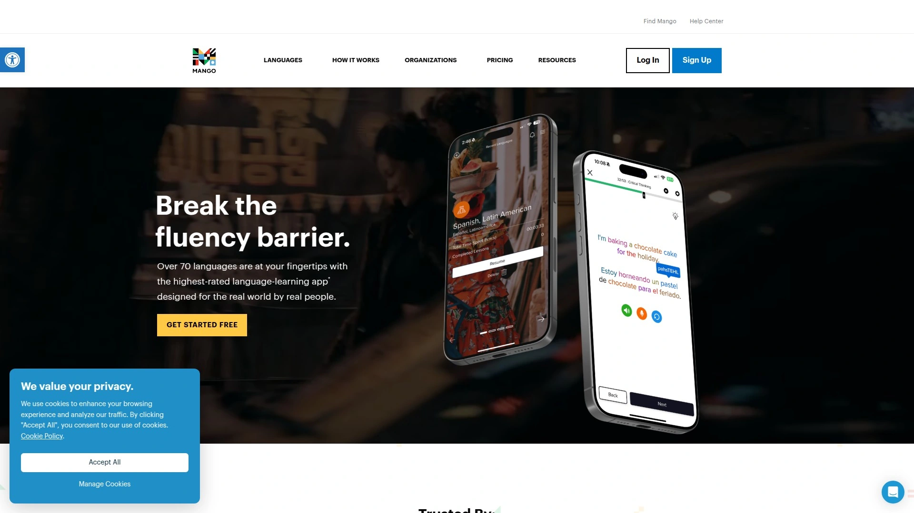

Mango Languages provides structured courses combining vocabulary, grammar, and cultural context. Detailed grammar explanations clarify rules explicitly. Cultural notes explain customs and social norms. This comprehensive approach suits learners wanting full understanding.

Interactive lessons adapt difficulty based on performance. Conversation simulations practice real-world situations. Voice comparison lets you record and compare against native speakers.

**Seventy-plus languages** include many rare options competitors don't offer. Extensive course content in each language. Multiple dialects available for major languages.

Typing activities help learners master foreign keyboards and writing systems. Alphabet courses teach non-Latin scripts systematically. These writing components provide well-rounded skills.

Often free through public libraries. Personal subscriptions around $8 monthly. This accessibility makes quality content available widely.

Best for learners wanting comprehensive grammar instruction and cultural understanding.

## [Transparent Language Online](https://www.transparent.com)

A library-focused platform offering 110+ languages with extensive vocabulary, alphabet courses, and all four language skills.

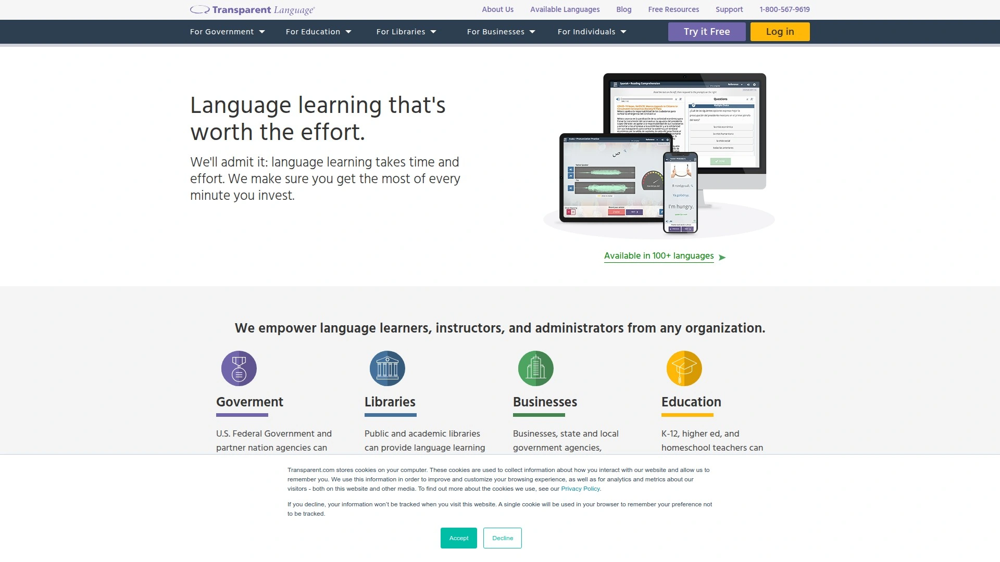

Transparent Language emphasizes breadth—110+ foreign languages plus 30+ English courses for non-native speakers. This extensive selection includes extremely rare languages unavailable elsewhere.

**Alphabet courses** teach writing systems in 38+ languages. Learn letter names, sounds, shapes, and keyboard locations systematically. This foundation essential for languages using unfamiliar scripts.

Over 2,300 unique words and phrases per language organized into courses and lessons. Native speaker audio for authentic pronunciation. Varied activities maintain engagement.

All four skills covered—reading, listening, speaking, writing. Typing activities build keyboard familiarity. Two typing modes accommodate beginners and advanced learners.

Primarily accessed through library subscriptions. Check local library for free access. Personal subscriptions available but less common.

Interface feels dated compared to modern apps. However, content depth compensates for visual design. Best for learners of rare languages or those wanting comprehensive skill development.

## [Mondly](https://www.mondly.com)

A gamified app featuring conversation-focused lessons, speech recognition, and AR/VR experiences across 40+ languages.

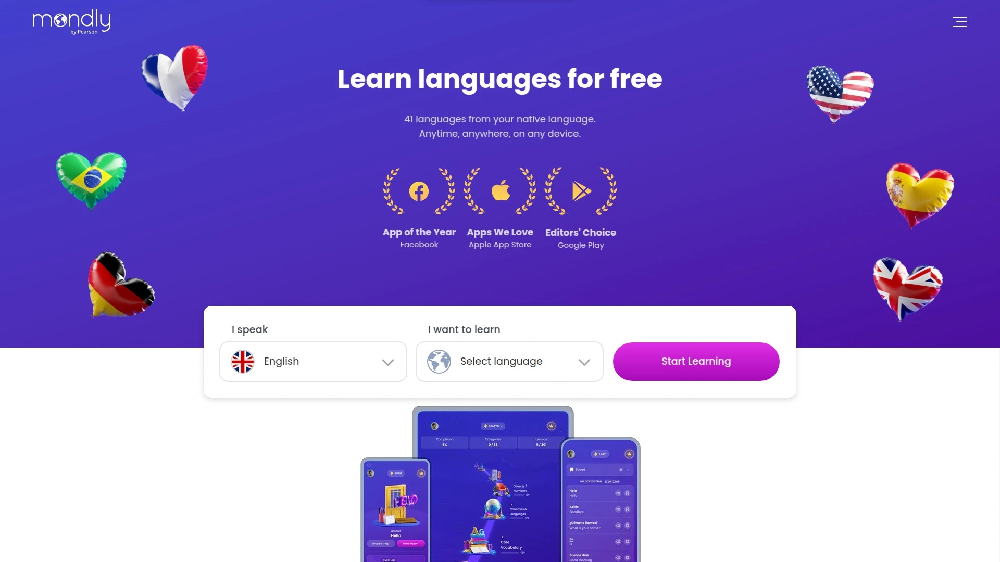

Mondly emphasizes conversational skills through dialogue-based lessons. Practical scenarios prepare for real-world communication. Speech recognition provides pronunciation feedback.

**Augmented and virtual reality experiences** available through separate apps. Practice conversations with AI chatbot in immersive environments. These cutting-edge features appeal to tech-enthusiasts.

Gamification through points, leaderboards, and achievements maintains motivation. Short lessons fit busy schedules. Visually appealing design makes learning feel like gaming.

Courses effective for vocabulary memorization. Spaced repetition reinforces learning. Progress tracking shows advancement.

Won't achieve native fluency alone. Best as supplementary tool. Grammar instruction adequate but not comprehensive.

Forty-plus languages including less common options. Subscription pricing competitive. Family plans available.

Best for learners wanting gamified, conversation-focused practice.

## [FluentU](https://www.fluentu.com)

A video-based platform teaching through authentic content like music videos, movie clips, and news with interactive subtitles and quizzes.

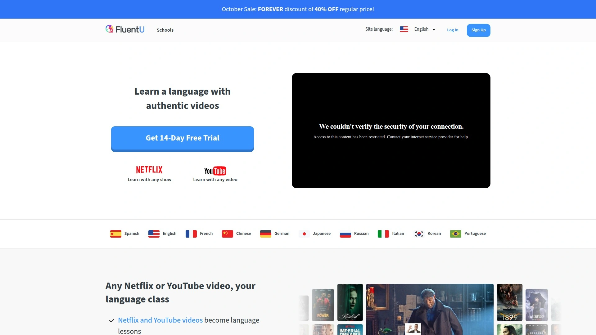

FluentU curates authentic videos—music videos, movie trailers, news broadcasts, inspirational talks. Content reflects how native speakers actually use language. This authenticity beats scripted textbook dialogues.

**Interactive subtitles** make every word clickable. Tap any word for instant definition with visual context. Video examples show word usage. This contextual learning aids comprehension.

Targeted vocabulary quizzes follow each video. Multiple question types reinforce learning. Flashcards created automatically from viewed content.

Content organized by difficulty level from beginner to advanced. Search by topic, format, or difficulty. Varied content types maintain interest.

Mobile app includes most features. Desktop experience slightly better for intensive study.

Subscription required for full access. Pricing competitive with similar video platforms. Best for intermediate learners wanting authentic content exposure.

## [Yabla](https://www.yabla.com)

A video immersion platform since 2001 offering thousands of authentic videos with dual subtitles, games, and vocabulary tools across six languages.

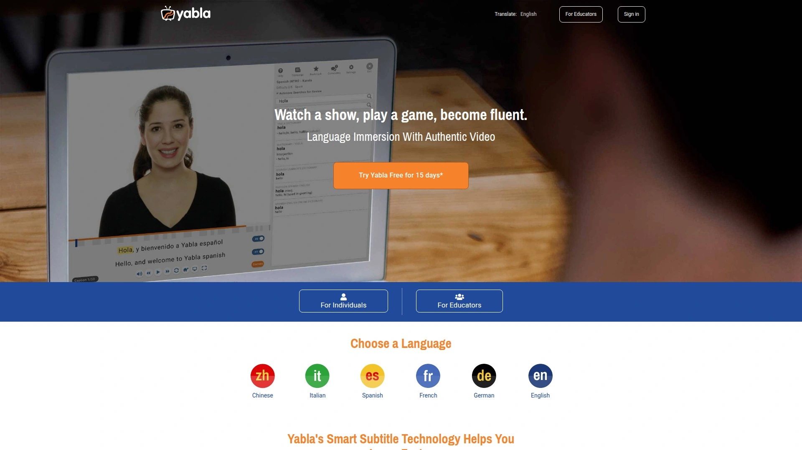

Yabla pioneered video-based language learning. Extensive library accumulated since 2005. Thousands of videos including TV shows, movies, documentaries, music videos.

**Dual subtitle system** shows both target language and translation simultaneously. Toggle between subtitles easily. Video speed adjustable for comprehension.

Varied practice games include transcription, fill-in-blank, multiple choice, translation, and comprehension questions. These diverse exercises develop different skills. More varied than competitors' quiz formats.

Written lessons accompany videos with embedded video examples. Grammar context provided. Vocabulary lists organized by video.

Only six languages available—Spanish, French, Italian, German, English, Chinese. Limited compared to competitors. Separate subscription required per language.

Interface feels dated but functional. Content quality compensates for retro design. Best for serious learners of available languages wanting extensive authentic content.

## [Lingopie](https://www.lingopie.com)

A Netflix-style learning platform streaming full-length foreign TV shows and movies with learning tools embedded directly into entertainment.

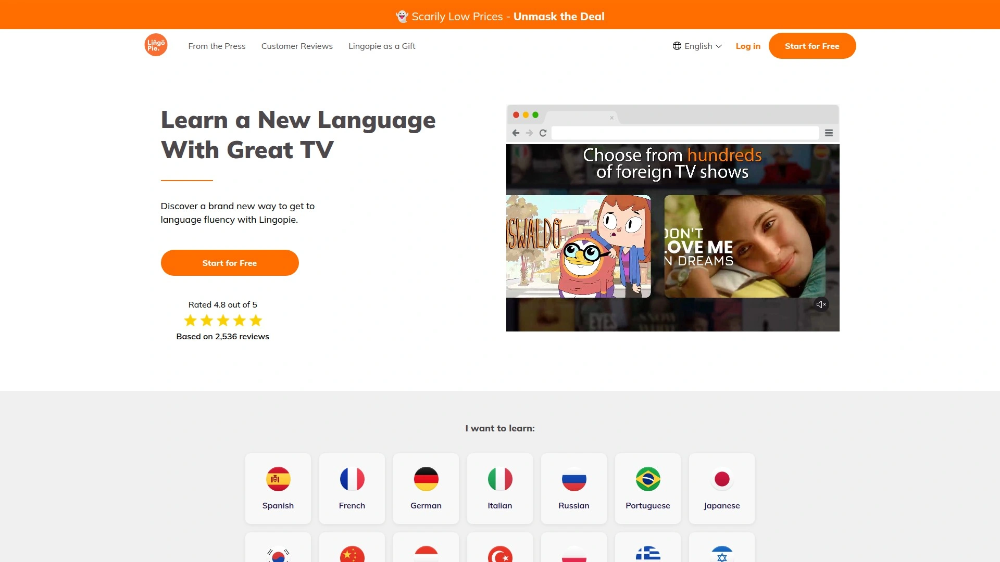

Lingopie focuses on full-length entertainment—complete TV series and movies including Netflix hits. Watch entire shows in target language with embedded learning tools. This entertainment-first approach keeps motivation high.

**Interactive subtitles** translate individual words on click. Video dictionary shows word usage across different contexts. Vocabulary lists generated from watched content.

Nine languages available—Spanish, French, German, Italian, Russian, Portuguese, Japanese, Korean, Chinese. Content library growing. Modern shows appeal to contemporary learners.

Speaking practice features include shadowing exercises. Music and audiobooks supplement video content. Optional group and private lessons available.

Netflix integration buggy and limited currently. Mobile app missing key features. Grammar support minimal with potential AI errors.

Subscription $12 monthly, $72 annually, or $199 lifetime. Best for entertainment-motivated learners wanting to watch shows while learning.

## [LingQ](https://www.lingq.com)

A content-based platform importing unlimited reading and listening materials with powerful vocabulary tracking across 40+ languages.

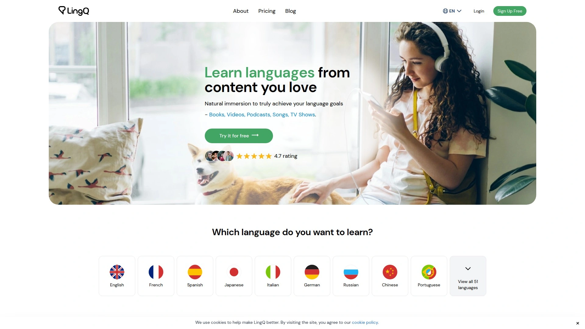

LingQ emphasizes comprehensible input through massive content consumption. Import articles, ebooks, podcasts, videos—any content. Built-in tools support reading and listening.

**LingQ system** tracks every new word encountered. Click unknown words to see definitions. Words progress through familiarity stages as you encounter them repeatedly. This organic vocabulary building mirrors natural language acquisition.

Extensive library of user-shared content plus ability to import anything. Read news, novels, blogs, academic papers—whatever interests you. Authentic materials provide real-world language exposure.

Forty-plus languages supported. Content volume varies by language. Popular languages have massive libraries.

No structured speaking practice. Passive skills emphasized over active production. Best paired with speaking practice elsewhere.

Free plan limited. Paid plans unlock unlimited imports and vocabulary. Best for self-directed learners wanting reading/listening fluency.

## [Drops](https://www.drops.io)

A visual vocabulary app featuring five-minute sessions, no translations, and beautifully designed word-picture associations.

Drops limits sessions to five minutes enforcing consistent daily practice. This constraint prevents burnout. Brief sessions feel manageable even on busiest days.

**Visual learning** teaches through elegant illustrations paired with words. No translations used—meaning conveyed through images. This immersive approach mirrors Rosetta Stone but with modern design.

Gamified swipe gestures make vocabulary practice feel like playing rather than studying. Fast-paced interactions maintain engagement. Minimal text reduces cognitive load.

Forty-plus languages available. Vocabulary categories organized by topics. Spaced repetition schedules reviews.

No grammar, speaking, or sentence construction. Purely vocabulary focused. Best as supplementary tool.

Free version allows one five-minute session daily. Premium removes time limits. Best for visual learners wanting vocabulary building.

## [Talkpal](https://talkpal.ai)

An AI-powered conversation simulator providing real-time speaking practice with chatbots and native speakers across multiple languages.

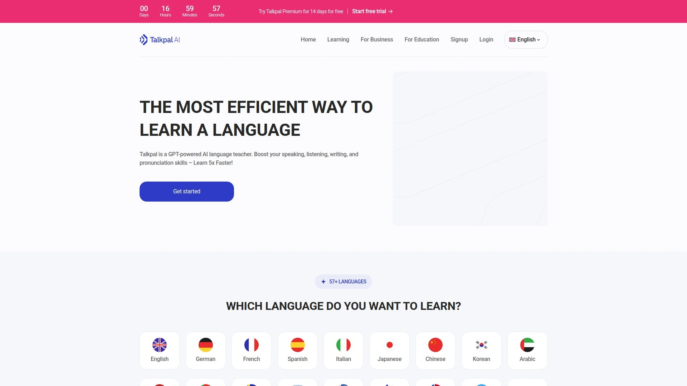

Talkpal emphasizes speaking through AI-driven conversation simulations. Chat with AI bots practicing real-life scenarios. Immediate feedback on pronunciation and grammar.

**Live practice** connects learners with native speakers globally. Real human conversations supplement AI practice. This combination develops confident speaking skills.

Customized lesson plans adapt to proficiency level. Gamification maintains motivation. Progress tracking shows improvement.

Dozens of languages supported. Suitable for beginners through advanced learners.

Subscription-based pricing. Best for learners prioritizing speaking confidence.

## [Rype](https://rypeapp.com)

A premium tutoring service offering unlimited one-on-one lessons with hand-picked teachers through monthly subscriptions.

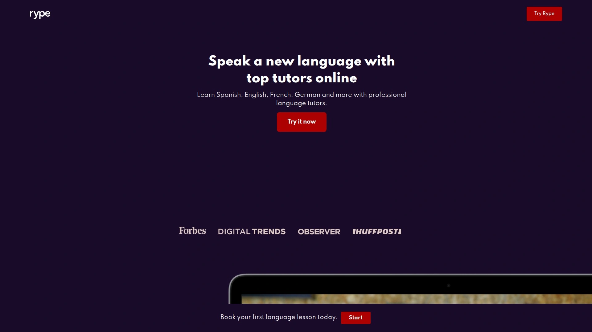

Rype differentiates through unlimited lesson model. Monthly subscription includes as many lessons as you want to book. This flat-rate approach suits intensive learners.

Hand-picked teachers undergo rigorous selection. Quality maintained through vetting process. Professional instruction emphasized.

Premium pricing reflects unlimited access model. Higher than per-lesson platforms but potentially better value for heavy users.

## [Baselang](https://www.baselang.com)

A Spanish-focused platform offering unlimited one-on-one tutoring through monthly subscription exclusively for Spanish learners.

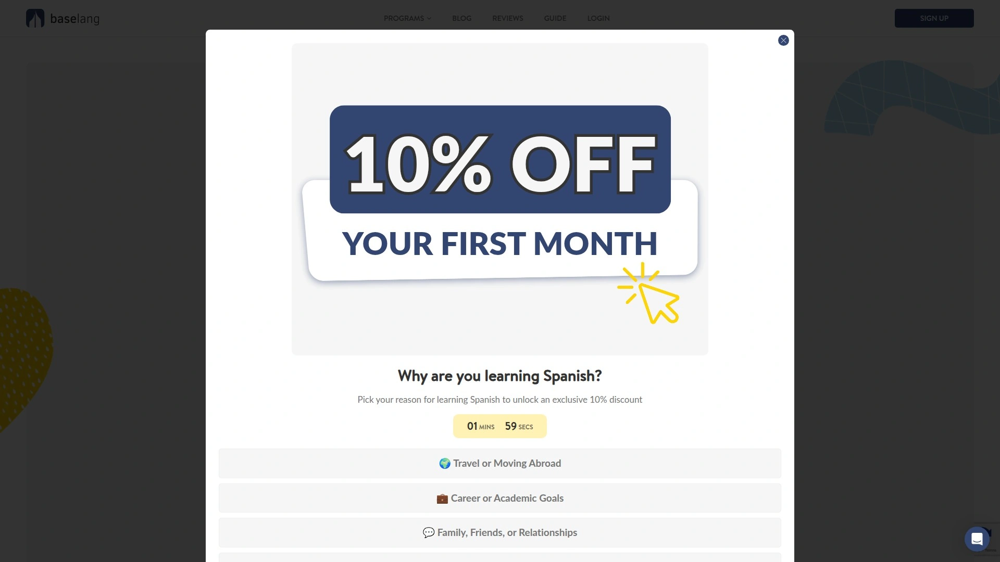

Baselang specializes exclusively in Spanish. Unlimited tutoring included in subscription. Flat monthly rate regardless of lesson frequency.

Live teachers available around the clock. Book lessons matching your schedule. Intensive immersion possible.

Best for serious Spanish students wanting unlimited access.

## [Rocket Languages](https://www.rocketlanguages.com)

A comprehensive course platform combining audio lessons, interactive exercises, and cultural training with lifetime access.

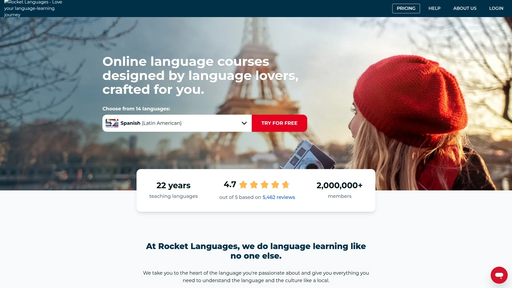

Rocket Languages provides complete courses purchased once with lifetime access. No ongoing subscriptions. Download everything for offline use.

Audio lessons formatted as conversations. Interactive exercises reinforce learning. Cultural lessons explain customs.

More expensive upfront than subscriptions. Best for committed learners wanting permanent access.

---

### Can I actually become fluent using these platforms without traveling abroad?

Fluency achievable through consistent practice combining multiple tools—use apps like Duolingo for grammar structure, platforms like italki for weekly conversation practice, and immersion tools like FluentU for authentic content exposure. Budget 6-12 months of daily practice for conversational fluency, 2-3 years for advanced proficiency. Travel accelerates but isn't mandatory with disciplined study.

### How much should I budget monthly for effective language learning?

Free options like Duolingo, HelloTalk, and Tandem provide legitimate progress at zero cost. Budget $10-30 monthly for quality apps like Babbel or Busuu. Add $40-100 monthly for weekly tutoring through Preply or italki at budget-friendly rates. Total $50-130 monthly delivers structured learning plus human interaction.

### Should I focus on apps or human tutors for faster progress?

Combine both for optimal results—apps build vocabulary and grammar foundation efficiently while tutors provide pronunciation correction and conversational confidence you can't get from software. Start with 2-3 months of app-based fundamentals, then add weekly tutoring as you build basic vocabulary. This staged approach maximizes learning efficiency versus cost.

***

### Conclusion

Stop wasting months bouncing between apps that teach you vocabulary you'll never use while avoiding the speaking practice you actually need. The right platform matches your learning style—whether that's structured courses, spontaneous conversations with tutors, or immersive video content—turning scattered efforts into measurable progress toward real-world fluency. For learners wanting the largest selection of qualified tutors across every major language with flexible scheduling and personalized curriculum that adapts to your specific goals, [Preply](#preply) delivers the most comprehensive tutoring marketplace by letting you filter thousands of verified teachers by price, specialization, and availability while providing integrated video lessons, progress tracking, and satisfaction guarantees that eliminate the risk of mismatched teaching styles.
